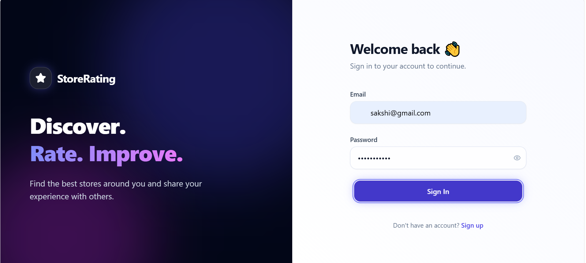
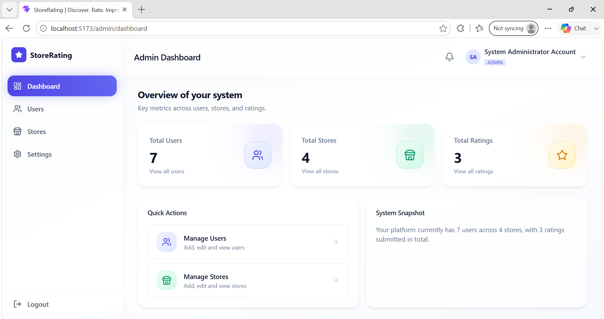
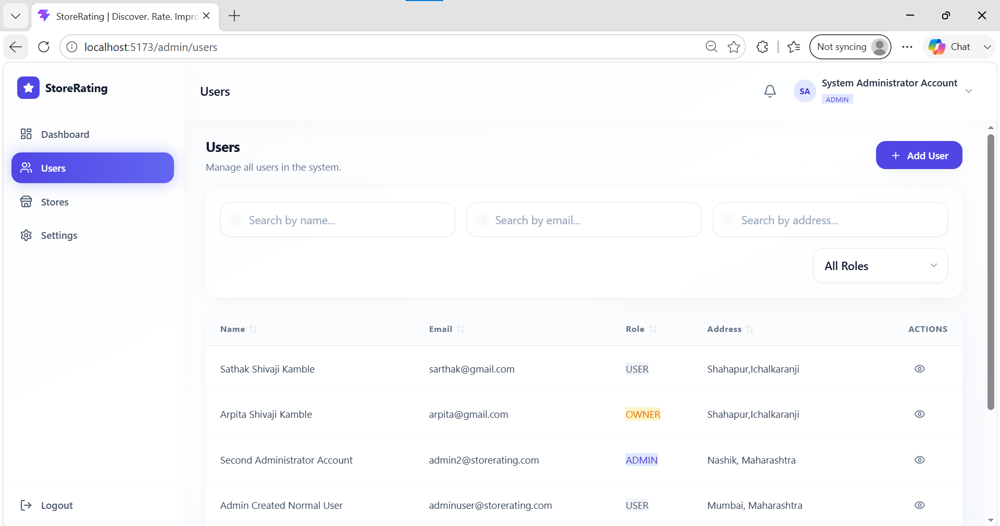
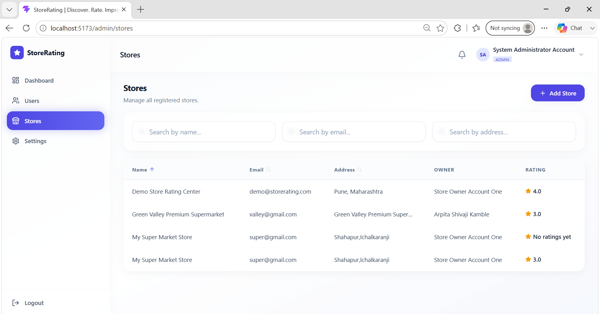
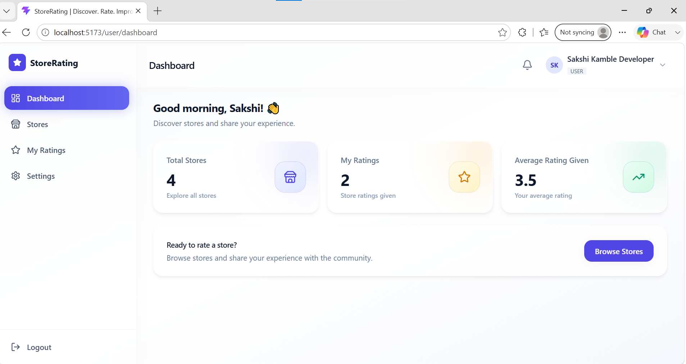
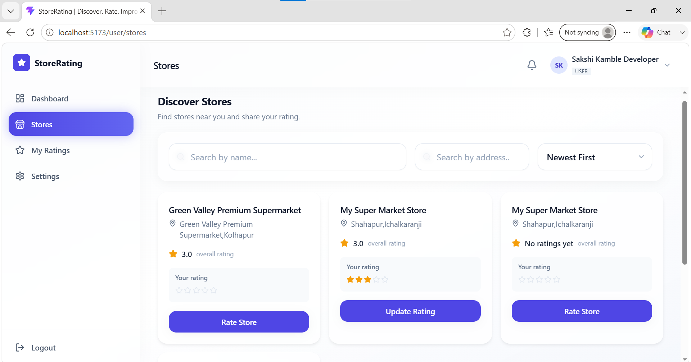
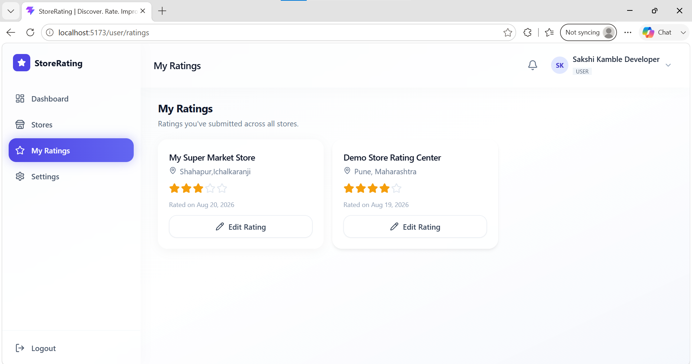
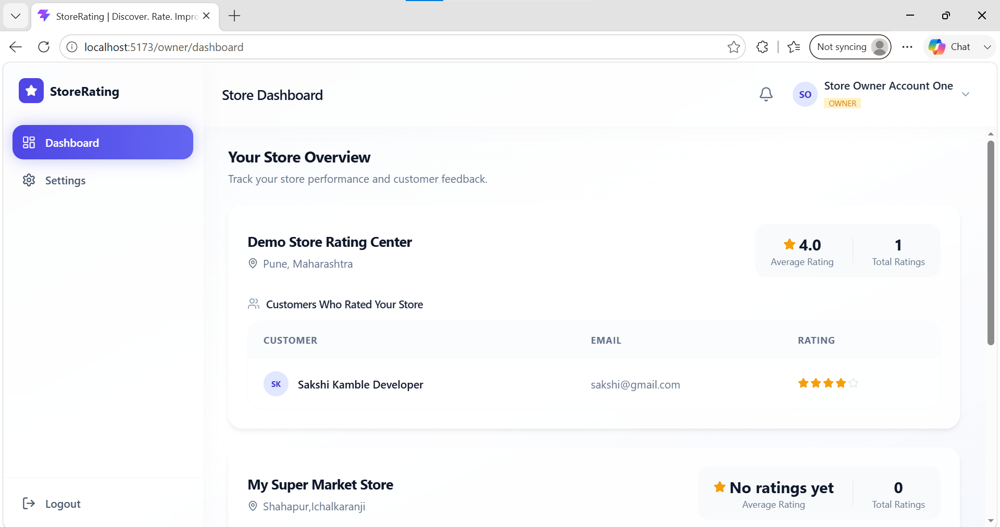
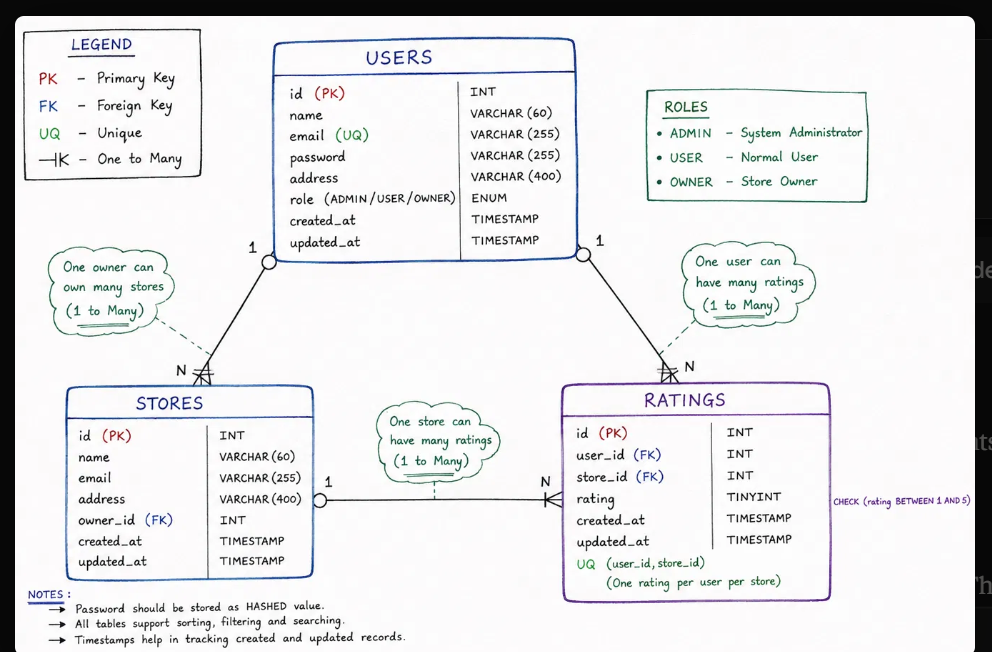

# 🏪 Store Rating System

A full-stack web application that allows users to discover stores, submit ratings from **1 to 5 stars**, and manage their ratings. The system provides role-based access for **System Administrators, Normal Users, and Store Owners**.

This project was developed as part of a **Full Stack Developer Intern Coding Challenge**.

---

## 🚀 Features

### 👨‍💼 System Administrator

- Admin login
- Dashboard with:
  - Total Users
  - Total Stores
  - Total Ratings
- Add new stores
- Add normal users
- Add admin users
- Manage users
- Manage stores
- Search and filter users
- Search and filter stores
- Sort tables in ascending/descending order
- View complete user details
- View store ratings
- View Store Owner rating information
- Logout

### 👤 Normal User

- User registration
- Login
- View all registered stores
- Search stores by name and address
- View overall store rating
- View personal submitted rating
- Submit rating from 1 to 5
- Modify previously submitted rating
- Update password
- Logout

### 🏪 Store Owner

- Store Owner login
- Dashboard
- View average store rating
- View total ratings
- View users who rated the store
- View submitted ratings
- Update password
- Logout

---

## 🔐 User Roles

| Role | Access |
|------|--------|
| **Admin** | Manage users, stores, ratings and dashboard |
| **Normal User** | Browse stores and submit/modify ratings |
| **Store Owner** | View store ratings and customers who submitted ratings |

---

## 🛠️ Tech Stack

### Frontend
- React.js
- Vite
- Tailwind CSS
- Axios
- React Router
- Lucide React

### Backend
- Node.js
- Express.js
- JWT Authentication
- REST API

### Database
- MySQL

---

## 🏗️ Project Structure

```text
Store_Rating_System/
│
├── Client/
│   └── Store Rating System/
│       ├── src/
│       │   ├── components/
│       │   ├── context/
│       │   ├── pages/
│       │   ├── services/
│       │   ├── utils/
│       │   ├── App.jsx
│       │   ├── main.jsx
│       │   └── index.css
│       │
│       ├── public/
│       ├── package.json
│       └── vite.config.js
│
├── Server/
│   ├── config/
│   ├── controllers/
│   ├── middleware/
│   ├── repositories/
│   ├── routes/
│   ├── validators/
│   ├── utils/
│   ├── scripts/
│   └── server.js
│
└── README.md
````

---

## 🗄️ Database Design

The application uses MySQL with relational tables for:

* Users
* Stores
* Ratings

### Main Relationships

```text
User
 │
 ├──────────────┐
 │              │
 ▼              ▼
Store Owner    Rating
 │              │
 ▼              ▼
Store ◄──────── User
```

A user can submit a rating for a store.

Each user can submit **only one rating per store**, but can modify that rating later.

Ratings are restricted to values between **1 and 5**.

---

## ✅ Validation

The application implements validation for:

### Name

* Minimum: 20 characters
* Maximum: 60 characters

### Address

* Maximum: 400 characters

### Password

* 8–16 characters
* At least one uppercase letter
* At least one special character

### Email

* Standard email format validation

### Rating

* Minimum: 1
* Maximum: 5

---

## 🔑 Authentication

The application uses **JWT-based authentication**.

After login:

```text
Login
  ↓
JWT Token
  ↓
Role Verification
  ↓
Role-Based Dashboard
```

Users are redirected to the appropriate functionality based on their role.

---

## 🔄 Application Flow

```text
                    ┌───────────────┐
                    │     Login     │
                    └───────┬───────┘
                            │
                ┌───────────┼───────────┐
                │           │           │
                ▼           ▼           ▼
             Admin        User        Owner
                │           │           │
                ▼           ▼           ▼
           Dashboard     Stores     Dashboard
                │           │           │
        ┌───────┼──────┐    │           │
        ▼       ▼      ▼    ▼           ▼
      Users   Stores  Stats Rating   View Ratings
```

---

## 💻 Installation & Setup

### 1. Clone the repository

```bash
git clone YOUR_GITHUB_REPOSITORY_URL
```

```bash
cd Store_Rating_System
```

---

### 2. Backend Setup

Navigate to the backend:

```bash
cd Server
```

Install dependencies:

```bash
npm install
```

Create a `.env` file:

```env
PORT=5000
DB_HOST=localhost
DB_USER=root
DB_PASSWORD=your_password
DB_NAME=store_rating_system
JWT_SECRET=your_secret_key
```

Configure the MySQL database according to the project's database scripts/schema.

Start the backend:

```bash
npm run dev
```

or:

```bash
npm start
```

---

### 3. Frontend Setup

Open another terminal:

```bash
cd Client/Store Rating System
```

Install dependencies:

```bash
npm install
```

Start the development server:

```bash
npm run dev
```

The frontend will run on:

```text
http://localhost:5173
```

---

## 🧪 Testing

The application was manually tested for the major user flows.

### Admin

* Login
* Dashboard
* Create User
* Create Admin
* Create Store
* User management
* Store management
* Search
* Filters
* Sorting
* User details
* Logout

### Normal User

* Signup
* Login
* Store search
* Submit rating
* Modify rating
* Password update
* Logout

### Store Owner

* Login
* Dashboard
* Average rating
* View rating users
* View submitted ratings
* Password update
* Logout

---

## 📸 Screenshots


















## 🔒 Security

The application follows common security practices including:

* JWT authentication
* Password hashing
* Role-based authorization
* Input validation
* Protected API routes
* Parameterized database queries
* Unique user-store rating constraint

Sensitive configuration such as database credentials and JWT secrets should be stored in environment variables.

---

## 📌 Future Improvements

Some possible future improvements:

* Email verification
* Forgot password functionality
* Advanced rating analytics
* Store categories
* Profile image support
* Advanced dashboard charts
* Notifications
* Deployment using cloud services

---

## 👩‍💻 Author

**Sakshi Shivaji Kamble**

B.Tech – Computer Science & Engineering

Interested in:

* Full Stack Development
* Java Backend Development
* React.js
* Node.js
* Database Development

---


